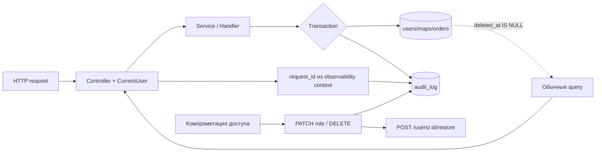

# Audit log и soft delete

Миграция `013_add_audit_and_soft_delete.sql` добавляет `deleted_at`, `created_by` и
`updated_by` в `users`, `maps`, `orders`, а также таблицу `audit_log`.

## Формат аудита

`audit_log` хранит `actor_user_id`, `action`, `entity_type`, `entity_id`,
`before_json`, `after_json`, `request_id`, `created_at`. Изменения статуса заказа,
владельца карты и роли пользователя записываются после успешного SQL update.
Для транзакционного изменения статуса запись аудита входит в ту же транзакцию,
что и заказ и Outbox-событие.

## Soft delete и восстановление

Удаление — это `UPDATE ... SET deleted_at = CURRENT_TIMESTAMP(3)`. Все обычные
списки, detail, activity, ownership checks и authentication добавляют
`deleted_at IS NULL`; удаленный пользователь не может войти или обновить refresh
token. Восстановление доступно администратору через `POST /users/:id/restore`
и `POST /maps/:id/restore`. Restore не удаляет историю аудита.

`created_by` и `updated_by` содержат actor ID последней операции (nullable для
системных/legacy записей). Если требуется юридически неизменяемый журнал,
доступ к `audit_log` следует ограничить отдельной DB role и отправлять копию в
append-only storage.

## Тестовые критерии

- удаленная запись отсутствует в обычном list/detail/activity;
- restore возвращает запись и снова разрешает authentication/ownership;
- status, ownership и role создают строки с before/after и request ID;
- повторное удаление/restore не создает ложный успешный результат.
