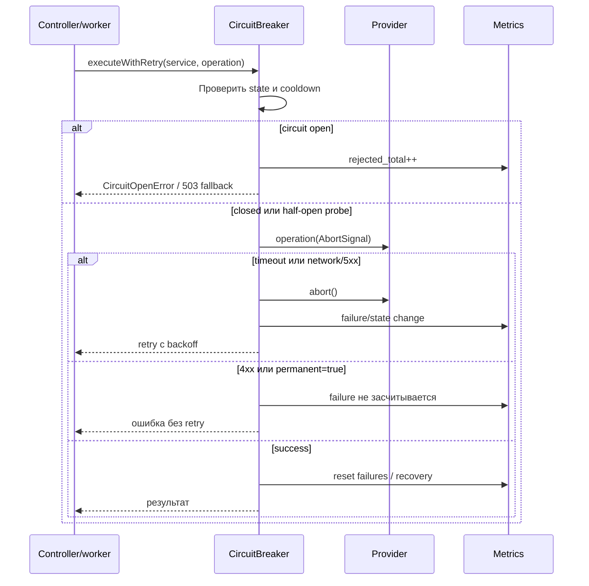
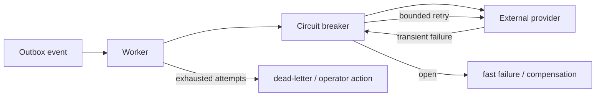

# Circuit breaker и timeout policy

## Проблема

Внешняя зависимость может отвечать медленно, временно быть недоступной или возвращать постоянную ошибку. Без общей политики каждый provider начинает по-разному задавать timeout и retry: запросы висят, retry создают лавину, а пользователь получает неясную ошибку.

## Решение

`CircuitBreaker` — единая обертка для вызовов storage, email, routing provider и платежей. Она ограничивает время операции через `AbortSignal`, выполняет небольшой retry только для transient errors и защищает систему от повторных вызовов неработающей зависимости.

```mermaid
stateDiagram-v2
    [*] --> closed
    closed --> closed: success / reset failures
    closed --> open: transient failures >= threshold
    open --> open: request rejected
    open --> half-open: cooldown elapsed
    half-open --> closed: probe success
    half-open --> open: probe failed
```

В текущем приложении реальный внешний HTTP boundary — S3-compatible storage. Для email, routing и payment provider-ов policy уже является общей точкой подключения; конкретные клиенты добавляют вызов через `executeWithRetry('email' | 'routing' | 'payment', ...)`. Внутренний поиск маршрутов не маскируется под внешний provider.

## Как проходит один вызов



Порядок важен: retry находится снаружи одной попытки `execute`, но каждая новая попытка заново проверяет circuit. Поэтому retry не может обойти fast-fail. В `half-open` одновременно разрешен только один probe; остальные запросы отклоняются до получения результата probe.

### Состояния и переходы

| Состояние | Поведение | Условие перехода |
| --- | --- | --- |
| `closed` | вызовы разрешены, transient failures считаются | failures достигли threshold → `open`; success → failures=0 |
| `open` | provider не вызывается, запрос завершается быстро | cooldown истек → `half-open` |
| `half-open` | разрешен один проверочный вызов | success → `closed`; failure → `open` |

Состояния изолированы по `serviceName`: `storage.s3` и `payment.stripe` не разделяют счетчик и не блокируют друг друга. Это особенно важно, потому что `CircuitBreaker` зарегистрирован как singleton Nest-модуль.

## Что считается ошибкой

Transient errors: timeout, разрыв соединения, DNS/TCP failure, HTTP 5xx и ошибки provider-а, которые явно не помечены permanent. Они могут повторяться и увеличивают счетчик circuit.

Permanent errors: HTTP 4xx и ошибки с `permanent: true`. Они возвращаются вызывающему коду сразу. Например, повторять невалидный платеж, несуществующий адрес получателя или ошибочный MIME type бессмысленно и иногда опасно.

Для платежей retry допустим только при наличии idempotency key и гарантии provider-а, что повтор не создаст второе списание. Если такой гарантии нет, payment client должен вызвать только `execute`, а бизнес-процесс — сохранить pending state и организовать reconciliation.

### Timeout и retry

Специализированные настройки имеют приоритет над общим значением:

| Переменная | Назначение | Default |
| --- | --- | ---: |
| `EXTERNAL_TIMEOUT_MS` | общий timeout | `2000` ms |
| `STORAGE_TIMEOUT_MS` | storage/S3 | значение общего timeout |
| `EMAIL_TIMEOUT_MS` | email provider | значение общего timeout |
| `ROUTING_TIMEOUT_MS` | routing provider | значение общего timeout |
| `PAYMENT_TIMEOUT_MS` | payment provider | значение общего timeout |
| `STORAGE_MAX_ATTEMPTS` | число попыток S3 | `2` |
| `CIRCUIT_FAILURE_THRESHOLD` | ошибок до `open` | `3` |
| `CIRCUIT_OPEN_DURATION_MS` | cooldown перед probe | `10000` ms |

Retry не выполняется для HTTP 4xx, ошибок с `permanent: true`, `CircuitOpenError` и после последней попытки. Таймаут считается transient error. Для API storage отказ преобразуется в `503` с `errorCode=STORAGE_UNAVAILABLE`, а фоновые задачи остаются совместимы с retry Outbox.

Значение `maxAttempts` включает первоначальный вызов. При `maxAttempts=2` provider получает максимум два запроса. Backoff рассчитывается как `min(maxDelayMs, baseDelayMs * 2^(attempt-1))`; случайная jitter-задержка пока не включена, поэтому для большого fleet ее следует добавить перед массовым production rollout.

Timeout начинается перед передачей операции и очищается в `finally`. Клиент внешней зависимости обязан использовать переданный `AbortSignal`; иначе circuit узнает о timeout, но сам SDK может продолжить работу в фоне.

## Метрики

- `circuit_breaker_state_changes_total{service,from,to}` — переходы состояний;
- `circuit_breaker_rejected_total{service}` — вызовы, отклоненные открытым circuit;
- `circuit_breaker_recovery_seconds{service}` — время от открытия до успешного probe.

Метрики позволяют отличить медленный provider от перегрузки приложения и определить, насколько быстро зависимость восстановилась.

Пример базовых alert-ов:

```promql
increase(circuit_breaker_rejected_total[5m]) > 0
```

```promql
increase(circuit_breaker_state_changes_total{to="open"}[10m]) > 0
```

Для диагностики нужно смотреть `service`, причину ошибки provider-а, request/correlation id и количество повторов. Не следует alert-ить только на единичный timeout: threshold и окно circuit уже сглаживают кратковременный шум.

## Когда это нужно

Механизм оправдан для сетевых вызовов, платежей, почты и storage, где timeout и повтор операции безопасны и явно определены. Для локальной функции или обычного SQL-запроса circuit breaker добавлять не следует: там лучше использовать transaction timeout, индексы и контроль пула соединений.

Не следует повторять платежную операцию без idempotency key, повторять permanent validation/auth errors или бесконечно увеличивать retry. Если provider не поддерживает безопасный retry, используется только timeout + понятная ошибка/компенсация.

## Fallback и пользовательский контракт

Синхронный запрос не должен ждать бесконечно. В storage-сценарии controller получает HTTP 503 и стабильный `STORAGE_UNAVAILABLE`; внутреннее сообщение provider-а не используется как контракт API. Для read-only routing допустим stale cache или сообщение «маршрут временно недоступен». Для email обычно сохраняется команда в Outbox, а для платежа возвращается `pending` с последующей сверкой.

Fallback выбирается по бизнес-смыслу, а не автоматически:

1. определить, можно ли безопасно повторить операцию;
2. если можно — использовать idempotency key и ограничить attempts;
3. если нельзя — сохранить состояние процесса и вернуть понятный результат;
4. записать metric/log с service и correlation id;
5. обеспечить manual или scheduled recovery.

## Настройка в окружениях

В development удобно уменьшить `CIRCUIT_OPEN_DURATION_MS`, чтобы быстро проверять recovery. В production timeout должен быть меньше API gateway timeout, иначе клиент завершит запрос раньше приложения. `maxAttempts` подбирается по latency provider-а и стоимости операции; для платежей он обычно равен 1 без подтвержденной идемпотентности.

Перед rollout следует проверить:

- provider корректно обрабатывает AbortSignal;
- 4xx не вызывают retry;
- открытый circuit не создает сетевой трафик;
- после cooldown проходит только один probe;
- recovery закрывает circuit и сбрасывает failures;
- метрики имеют низкую кардинальность service label.

## Связь с Outbox и worker

Circuit breaker защищает одну попытку обращения к provider-у, а Outbox отвечает за доставку фонового события и долговременное восстановление. Это разные уровни:



Нельзя считать circuit breaker заменой Outbox: он не хранит незавершенную бизнес-операцию после рестарта. И наоборот, Outbox не должен отправлять бесконечные попытки в заведомо неработающий provider без circuit protection.

## Тестирование

Unit-тесты проверяют timeout, открытие circuit, half-open recovery и отсутствие retry для permanent error. Интеграционный lifecycle-тест проверяет последовательность `timeout -> open -> half-open -> recovery`:

```bash
npm --prefix backend test -- --runInBand src/resilience/circuit-breaker.spec.ts
npm --prefix backend run test:integration -- --runInBand src/resilience/circuit-breaker.integration-spec.ts
```
