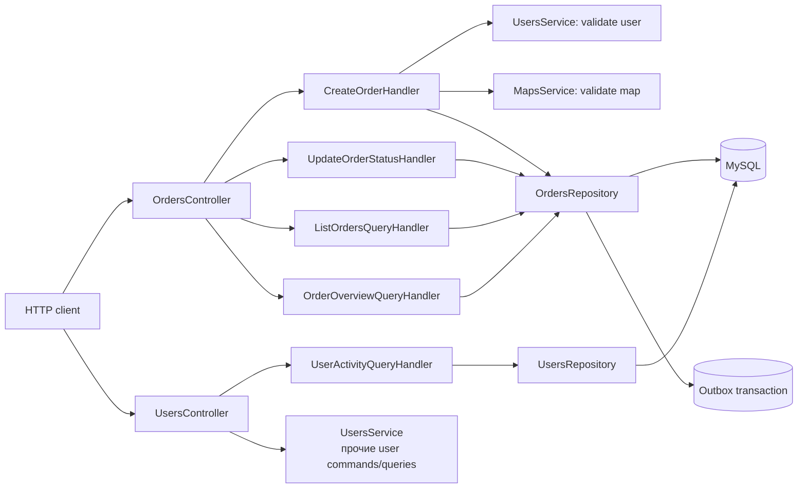

# CQRS для `orders` и `users`

В модуле orders HTTP-контроллеры только принимают DTO/параметры и передают их
handler'ам. Команды изменяют состояние, а query handler'ы читают данные и
готовят параметры пагинации. HTTP-маршруты, DTO и форматы ответов сохранены.

## Схема взаимодействия

Команда создания заказа сохраняет `orders` и `outbox_events` одной транзакцией,
а команда смены статуса сохраняет optimistic/pessimistic locking. Query
handler'ы не меняют состояние: `ListOrdersQueryHandler` отвечает за списки и
offset-пагинацию, `OrderOverviewQueryHandler` — за JOIN-отчет, а
`UserActivityQueryHandler` — за offset/cursor-пагинацию activity.

## Когда CQRS не нужен

CQRS не следует добавлять автоматически. Обычного application service обычно
достаточно, если:

- модель чтения и модель записи почти одинаковы;
- операции простые и не требуют разных транзакционных границ;
- нет самостоятельной сложности в отчетах, пагинации или интеграционных
  командах;
- проект небольшой, а дополнительное число файлов и DI-зависимостей ухудшит
  читаемость;
- нет потребности масштабировать чтение и запись независимо или строить
  отдельные read-модели.

Разделение оправдано, когда команды и запросы меняются с разной скоростью,
имеют разную нагрузку/модель данных, или orchestration уже перегружает
контроллер и сервис. CQRS не означает обязательное использование брокера,
event sourcing или отдельных баз данных.

## Проверка регрессии

- Unit-тесты handler'ов проверяют orchestration, нормализацию cursor и маппинг
  доменных ошибок в HTTP-исключения.
- Существующий `src/api.e2e-spec.ts` продолжает проверять создание заказа,
  Outbox, activity pagination и idempotency retry через прежние API-маршруты.

