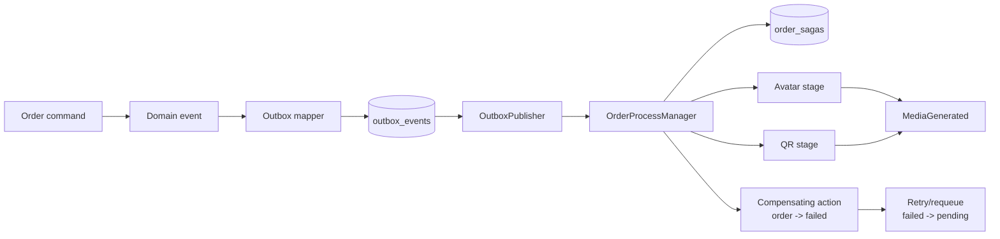
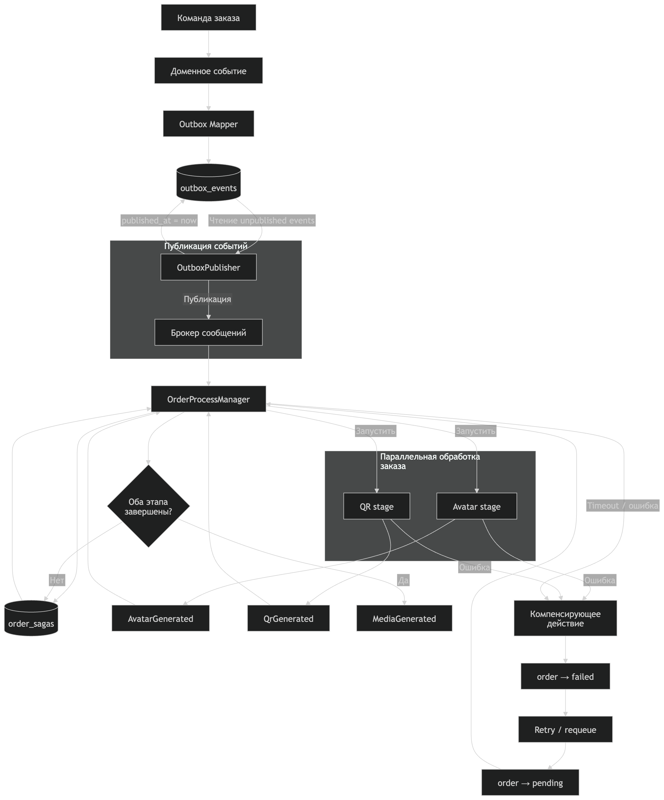

# Domain Events и Process Manager/Saga

## Зачем нужны три слоя

В приложении разделены:

1. **Domain event** — бизнес-факт, не знающий о MySQL и Outbox. Примеры:
   `OrderCreated`, `OrderStatusChanged`, `MediaGenerated`.
2. **Outbox envelope** — инфраструктурное представление для надежной доставки:
   `event_type`, `aggregate_type`, `aggregate_id`, `payload`, retry/lease fields.
3. **Process Manager** — оркестратор длительного workflow заказа. Он хранит
   прогресс Saga, вызывает следующие шаги и выполняет compensation при ошибке.



Та же схема в виде подготовленной иллюстрации:



Mapper сохраняет обратную совместимость transport names:

| Domain event | Outbox `event_type` | Aggregate |
| --- | --- | --- |
| `OrderCreated` | `order.created` | `order` |
| `OrderStatusChanged` | `order.status_changed` | `order` |
| `MediaGenerated` | `media.generated` | `media` |

`order.created` по-прежнему содержит `orderId`, `userId`, `mapId` и
`totalAmount`, поэтому существующие Outbox/API сценарии не меняются.

## State machine заказа

Проверка выполняется до изменения статуса. Недопустимый переход возвращает
`400`, optimistic lock conflict — `409`.

| Текущий статус | Допустимые следующие статусы |
| --- | --- |
| `pending` | `paid`, `completed`, `cancelled`, `failed` |
| `paid` | `completed`, `cancelled`, `failed` |
| `completed` | нет |
| `cancelled` | нет |
| `failed` | `pending`, `cancelled` |

Переход `failed -> pending` нужен только для возобновления Saga после
compensation/requeue. Любое изменение статуса записывает `OrderStatusChanged`
в Outbox в той же транзакции, что и изменение `orders`.

## Order Process Manager

Для каждого заказа создается строка `order_sagas`:

- `status`: `running`, `completed` или `failed`;
- `current_stage`: `avatar`, `qr` или `completed`;
- `completed_stages`: JSON-массив завершенных шагов;
- `last_error`: последняя причина сбоя.

Workflow:

1. `OrderCreated` создает Saga в состоянии `running`.
2. `avatar` вызывает `MediaService.generateUserAvatar`.
3. Успешный шаг фиксируется в `completed_stages`.
4. `qr` вызывает `MediaService.generateMapQr`.
5. После обоих шагов Saga становится `completed`.

Повторная доставка того же Outbox-события не начинает workflow с нуля:
`startOrResume` читает `completed_stages` и пропускает завершенные шаги.
Повторная генерация media также защищена idempotent lookup по seed/payload.

## Ошибка и compensation

Если падает любой stage, Process Manager:

1. сохраняет Saga как `failed` и пишет `last_error`;
2. переводит заказ в `failed` через компенсирующее действие;
3. пробрасывает ошибку Outbox worker, чтобы применился retry/dead-letter policy.

При requeue следующая попытка переводит `failed -> pending`, оставляет уже
завершенные stages и продолжает workflow с первого незавершенного шага.

Примеры:

| Сбой | Что уже завершено | Что выполняется при resume |
| --- | --- | --- |
| avatar | ничего | avatar, затем qr |
| qr | avatar | только qr |

Compensation сейчас intentionally минимальна и безопасна: она откатывает
доменное состояние заказа в `failed`, но не удаляет ранее созданный media asset.
Удаление медиа требует отдельной политики владения/cleanup, чтобы не удалить
asset, который существовал до Saga или используется другой операцией.

## Тестирование

Unit-тесты покрывают domain event mapper и state machine. Integration workflow
тесты моделируют падение каждой стадии и проверяют resume:

```bash
RUN_INTEGRATION_TESTS=true \
  ./node_modules/.bin/jest --runInBand \
  src/orders/sagas/order-process-manager.integration-spec.ts
```

Для SQL-интеграции нужны MySQL и миграции `012_add_order_sagas.sql`. Полный
e2e-поток создания заказа остается в `src/api.e2e-spec.ts`; после обработки
`order.created` Outbox worker дополнительно создает `media.generated` events.
