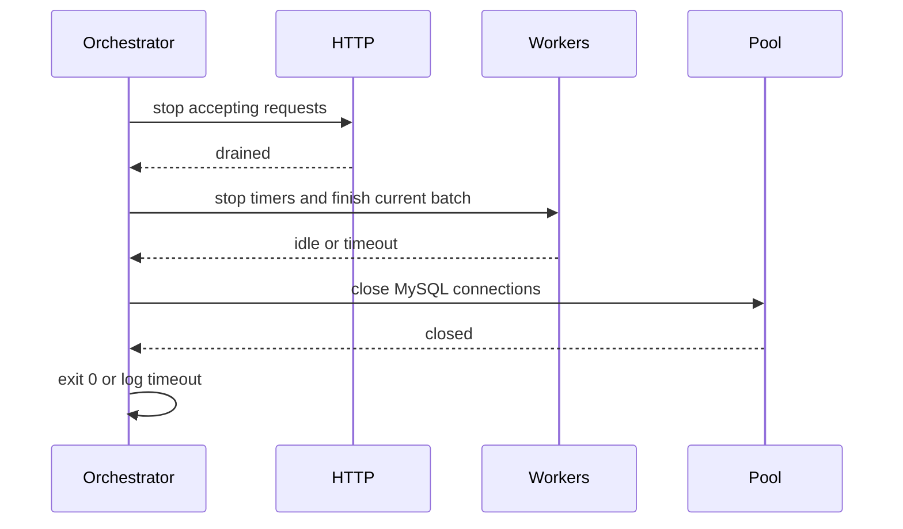

# Readiness/liveness и graceful shutdown

## Проблема

Один health endpoint не различает «процесс жив» и «процесс может принимать
трафик». При недоступном MySQL, storage или остановленном worker балансировщик
может продолжать направлять запросы в экземпляр. При завершении процесса без
координации HTTP, worker и connection pool закрываются в неопределенном порядке:
новые запросы могут потерять запись, а worker — оставить lease в промежуточном
состоянии.

## Решение

- `GET /health/live` — быстрый probe процесса, без сетевых зависимостей;
- `GET /health/ready` — проверяет `SELECT 1` в MySQL, выбранный storage backend и
  состояние Outbox worker; старый `GET /health` сохранен как alias readiness;
- `GRACEFUL_SHUTDOWN_TIMEOUT_MS` ограничивает общее ожидание закрытия (по
  умолчанию 10 секунд);
- SIGTERM/SIGINT сначала закрывают HTTP через `app.close()`, затем Nest lifecycle
  останавливает polling workers, дожидается текущего tick и закрывает MySQL pool.
  Inbox worker также ждет активный batch до общего timeout.

Последовательность:

Readiness должен быть исключен из auth middleware и использоваться в readiness
probe оркестратора; liveness не должен зависеть от базы, иначе временный сбой БД
приведет к перезапуску здорового процесса.
