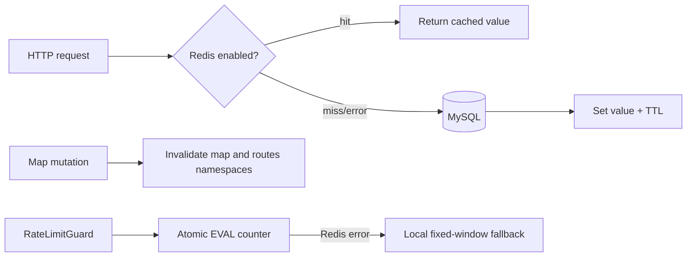

# Redis-кэш и distributed rate limiting

## Проблема

Частые nearby/read-heavy запросы повторно считают одинаковые результаты и
создают лишнюю нагрузку на MySQL. Локальный in-memory rate limiter видит только
один backend-инстанс: после балансировщика клиент может получить отдельный лимит
на каждом процессе. Обязательная зависимость от Redis также сделала бы API
недоступным при кратковременном сбое Redis.

## Решение и зачем это нужно

Redis включается переменной `REDIS_URL`. Используется cache-aside: сначала
читается Redis, при miss результат считается из DB и записывается с коротким
TTL. Изменение карты удаляет связанные ключи, поэтому поиск не отдает устаревшие
координаты и title. Rate limit использует атомарный Redis counter, общий для
всех процессов, а при ошибке переключается на локальное окно. Это снижает DB
load, делает лимиты одинаковыми между инстансами и не превращает Redis в single
point of failure.

| Данные | Ключ | TTL | Инвалидация |
| --- | --- | ---: | --- |
| nearby routes | `routes:nearby:{lat}:{lon}:{radius}:{limit}` | 30 сек | при изменении карты |
| карта по ID | `map:{id}` | 300 сек | update/delete/restore карты |
| route maps | `routes:maps:{sortedIds}` | 300 сек | при изменении карты |
| rate limit | `rate:{ip}:{path}` | размер окна | атомарный Redis EVAL |

Ключи включают все параметры, влияющие на результат. TTL nearby короткий из-за
изменения карт, TTL entities длиннее, потому что detail-read меняется только
через mutation с invalidation.

## Схема

## Fallback и эксплуатация

`REDIS_TIMEOUT_MS` задает timeout команды (по умолчанию 500 мс). Без `REDIS_URL`
приложение работает без Redis. При сетевой ошибке cache пропускается, а rate
limiter использует in-memory fixed window. Мониторятся
`cache_hits_total{cache="redis"}`, `cache_misses_total{cache="redis"}` и
доля fallback через `/metrics`. TTL не следует увеличивать без оценки stale-data
риска.

Метрики `cache_hits_total{cache="redis"}` и
`cache_misses_total{cache="redis"}` доступны через `/metrics`. Redis integration
test запускается с `RUN_REDIS_TESTS=true`.
