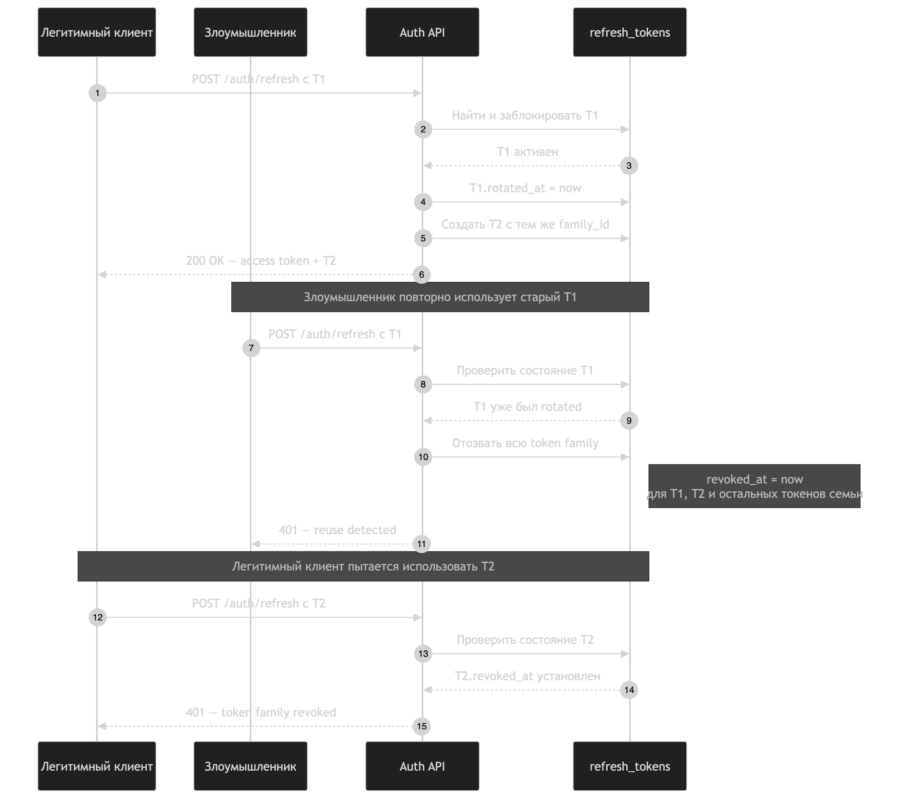

# Authentication и безопасность

## Auth API

- `POST /auth/register` — регистрация пользователя, Argon2id password hash и JWT pair.
- `POST /auth/login` — проверка email/password.
- `POST /auth/refresh` — ротация refresh token.
- `POST /auth/logout` — отзыв refresh token текущего пользователя.

Пример:

```bash
curl -X POST http://localhost:3000/auth/register \
  -H 'Content-Type: application/json' \
  -d '{"email":"user@example.com","name":"User","password":"correct horse battery staple"}'
```

Защищенный запрос передает только access token:

```bash
curl http://localhost:3000/maps/1 \
  -H "Authorization: Bearer $ACCESS_TOKEN"
```

Access token живет 15 минут. Refresh token живет 30 дней, хранится у клиента и
ротируется при каждом `/auth/refresh`. В БД сохраняется только SHA-256 hash
refresh token, не его исходное значение. Каждый refresh token входит в отдельную
token family. При rotation старый токен получает `rotated_at`; повторное
использование rotated/revoked токена считается reuse detection и отзывает всю
family через `revoked_at`. Logout отзывает все refresh-токены пользователя.

Секреты `JWT_ACCESS_SECRET` и `JWT_REFRESH_SECRET` обязательны для production;
dev fallback в коде предназначен только для локального запуска и должен быть
заменен в deployment env.

## Компрометация и массовый logout

Массовый отзыв происходит на двух уровнях:

1. **Компрометация одной refresh-сессии.** Клиент сначала успешно делает
   rotation: старая запись получает `rotated_at`, а новая сохраняется с тем же
   `token_family_id`. Если старый токен предъявлен повторно, это reuse detection.
   В одной транзакции все записи этой family получают `revoked_at`, запрос
   получает `401`, и даже самый новый refresh token этой family больше нельзя
   использовать.
2. **Logout пользователя.** `POST /auth/logout` с действующим access token
   вызывает `revokeAllRefreshTokens(userId)` и устанавливает `revoked_at` у всех
   неотозванных refresh-токенов пользователя, включая все его token family.

Схема массового отзыва токенов:



Последовательность reuse detection:

```mermaid
sequenceDiagram
  participant C as Legitimate client
  participant A as Attacker/old token
  participant API as Auth API
  participant DB as refresh_tokens

  C->>API: POST /auth/refresh (T1)
  API->>DB: T1.rotated_at = now; insert T2 (same family)
  A->>API: POST /auth/refresh (T1 повторно)
  API->>DB: revoke all rows with family_id
  API-->>A: 401 reuse detected
  C->>API: POST /auth/refresh (T2)
  API->>DB: T2.revoked_at уже установлен
  API-->>C: 401 token family revoked
```

Важно: logout отзывает refresh-токены, но не может задним числом отменить уже
выданные access JWT. Они остаются действительными до своего короткого expiry
(сейчас 15 минут). В текущем API нет отдельного admin endpoint для emergency
logout другого пользователя. Для операционного emergency revoke используется
тот же SQL-механизм на уровне БД:

```sql
UPDATE refresh_tokens
SET revoked_at = COALESCE(revoked_at, CURRENT_TIMESTAMP(3))
WHERE user_id = ? AND revoked_at IS NULL;
```

## Roles и ownership

Роли: `user` и `admin`. Новая регистрация создает `user`; создание admin выполняет
администратор через контролируемую SQL-операцию или отдельный provisioning flow:

```sql
UPDATE users SET role = 'admin' WHERE email = 'admin@example.com';
```

`JwtAuthGuard` валидирует Bearer access token, `RolesGuard` проверяет `@Roles`, а
`OwnershipGuard` запрещает user читать/изменять чужие users, maps, orders и media.
Администратор проходит ownership-проверки по роли.

Обычный `POST /users` оставлен только для admin; публичное создание пользователя
выполняется через `/auth/register`, чтобы пароль всегда проходил Argon2 hashing.

## Rate limiting

`RateLimitGuard` защищает register/login/refresh fixed-window лимитом в памяти
процесса:

| Переменная | Default |
| --- | ---: |
| `RATE_LIMIT_MAX` | `10` |
| `RATE_LIMIT_WINDOW_MS` | `60000` |

При превышении возвращается HTTP `429`. In-memory limiter не синхронизируется
между backend-инстансами и сбрасывается после рестарта; production с несколькими
репликами должен перенести counters в Redis/API gateway.

## Ограничения

- JWT secrets нельзя хранить в git или использовать dev fallback в production.
- Refresh token следует хранить в защищенном HttpOnly/Secure/SameSite cookie либо
  в защищенном клиентском хранилище; не помещать его в URL.
- Refresh-токены хранятся в `refresh_tokens`; несколько login-сессий могут иметь
  разные token family. Reuse detection отзывает всю скомпрометированную family,
  а logout отзывает все family пользователя.
- Если access token также скомпрометирован, его нельзя немедленно отозвать
  текущей реализацией; для этого нужен короткий TTL, key rotation или server-side
  denylist/session versioning.
- После добавления auth старые пользователи из seed с `password_hash = NULL` не
  могут войти, пока им не назначен пароль через безопасный provisioning flow.
- Ownership guard делает SQL-проверки на каждый защищенный resource request;
  при росте нагрузки их можно заменить policy layer/cache, не ослабляя проверку.
