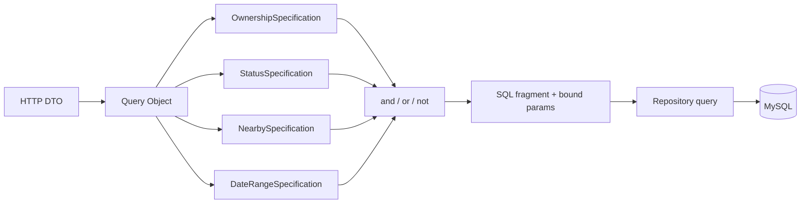

# Specification pattern для SQL-фильтров

## Идея

Specification описывает один переиспользуемый предикат и возвращает пару
`{ sql, params }`. Значения никогда не вставляются в SQL строкой. Query Object
собирает спецификации под конкретный запрос, добавляет `SELECT`, `JOIN`,
`ORDER BY` и pagination.



## Реализованные спецификации

| Спецификация | SQL-назначение | Подключенный запрос |
| --- | --- | --- |
| `ownership(userId)` | `owner_user_id = ?` | `MapsRepository.findAll` |
| `status(value)` | `status = ?` | `OrdersRepository.findAll/findOverview` |
| `nearby(point, radius)` | безопасный latitude/longitude bounding box | `RoutesRepository.findNearby` |
| `dateRange(from, to)` | `created_at >= ?` и/или `created_at <= ?` | `ReportsRepository.findOrdersPage` |

Имена колонок не принимаются из HTTP. Они ограничены TypeScript union-типами,
а пользовательские значения (`userId`, status, координаты и даты) передаются
только в массиве параметров MySQL.

## Композиция

```ts
and(
  ownership(7),
  or(status('paid'), not(status('cancelled'))),
)
```

Результат:

```sql
(owner_user_id = ?)
AND ((status = ?) OR (NOT (status = ?)))
```

Параметры сохраняют порядок обхода дерева:

```ts
[7, 'paid', 'cancelled']
```

Это позволяет строить сложные фильтры без конкатенации пользовательского SQL.
Для пустой композиции используется нейтральное условие `1 = 1`.

## Specification и Query Object: сравнение

| Критерий | Specification | Query Object |
| --- | --- | --- |
| Ответственность | Один переиспользуемый predicate | Полный read-query и его SQL shape |
| Повторное использование | Высокое: ownership/status/date могут жить в разных запросах | Среднее: обычно привязан к одной выборке |
| Геометрия и вложенная логика | Удобно комбинировать `and/or/not` | Удобно управлять JOIN, сортировкой и pagination |
| Контроль индексов/EXPLAIN | Косвенный, зависит от итогового SQL | Прямой, запрос виден целиком |
| Риск чрезмерной абстракции | Много маленьких объектов и сложный debug | Дублирование predicates между запросами |

Практическое правило: Specification подходит для повторяющихся условий доступа
и фильтрации, а Query Object остается владельцем формы конкретного SQL-запроса.
Не стоит превращать каждый фрагмент `SELECT` или `ORDER BY` в Specification.

## Тестирование

`src/common/sql/specifications/filter-specifications.spec.ts` проверяет каждый
тип спецификации и композицию параметров. `query-objects.spec.ts` проверяет,
что потенциально опасные значения остаются в `params`, а repository tests
проверяют фактическое подключение fragments к maps/orders/routes/reports.
